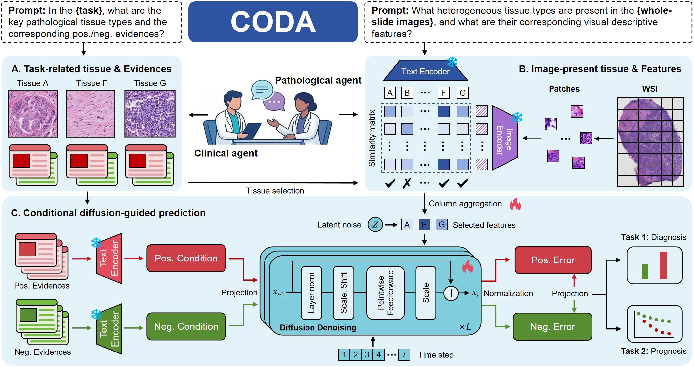

# SSD_ICG

## Conditional Diffusion–guided Dual-agent Collaboration for Pathological Heterogeneous Analysis in Breast Cancer

<div align=left></div>

## Installation
Clone the repo:
```bash
git clone https://github.com/liulian900000/CODA && cd CODA
```
Create a conda environment and activate it:
```bash
conda create -n env python=3.10
conda activate env
pip install -r requirements.txt
```

## Offline stage
- **WSI Preprocessing** 
  - Please refer to [CLAM](https://github.com/mahmoodlab/CLAM)--Lu M Y, Williamson D F K, Chen T Y, et al. Data-efficient and weakly supervised computational pathology on whole-slide images[J]. Nature biomedical engineering, 2021, 5(6): 555-570.
 
- **Feature Embedding** 
  - Please refer to [CONCH](https://github.com/mahmoodlab/CONCH)--Lu, Ming Y and Chen, Bowen and Williamson, et al. A visual-language foundation model for computational pathology[J]. Nature Medicine, 2024, 30(3): 863-874.
 
- **Patch Match**
  - Running the following command-line for patch match:
  ```bash
  python Patch_Match.py
  ```

## Online stage
 
- **Training of CODA**
  - Running the following command-line for model training:
  ```bash
  python training.py
  ```

- **Validation of CODA**
  - Running the following command-line for model inference and result statistics:
  ```bash
  python validation.py
  ```

## Saved model
- Our trained SSD_ICG model is avaliable at [saved_model](https://github.com/liulian900000/CODA/model), which performing as:
  | Dataset | ROC-AUC | C-index|
  | ----- |:--------:|:--------:|
  | C16 | 0.9857 | ***** |
  | BRCA | ***** | 0.75 |

## Citation
- If you found our work useful in your research, please consider citing our work at:
```
@article{HOU2026104069,
title = {Predicting neoadjuvant therapy response in breast cancer from preoperative biopsy via spatial-semantic-differential learning and interpretable clinicopathological-guided fusion},
journal = {Medical Image Analysis},
pages = {104069},
year = {2026},
issn = {1361-8415},
doi = {https://doi.org/10.1016/j.media.2026.104069},
url = {https://www.sciencedirect.com/science/article/pii/S1361841526001374},
author = {Wen-Tai Hou and Zi-Fei Pu and Ze-Yan Xu and An-Hao Wu and Zhi-Hao Liu and Ke Zhao and Cheng-Lu Duan and Jia Guo and Kai Chen and Si-Qi Qiu and Zhi-Cheng Du and Xue Zhao and Jing-Wen Bai and Huan-Cheng Zeng and Guo-Jun Zhang}
}
```
